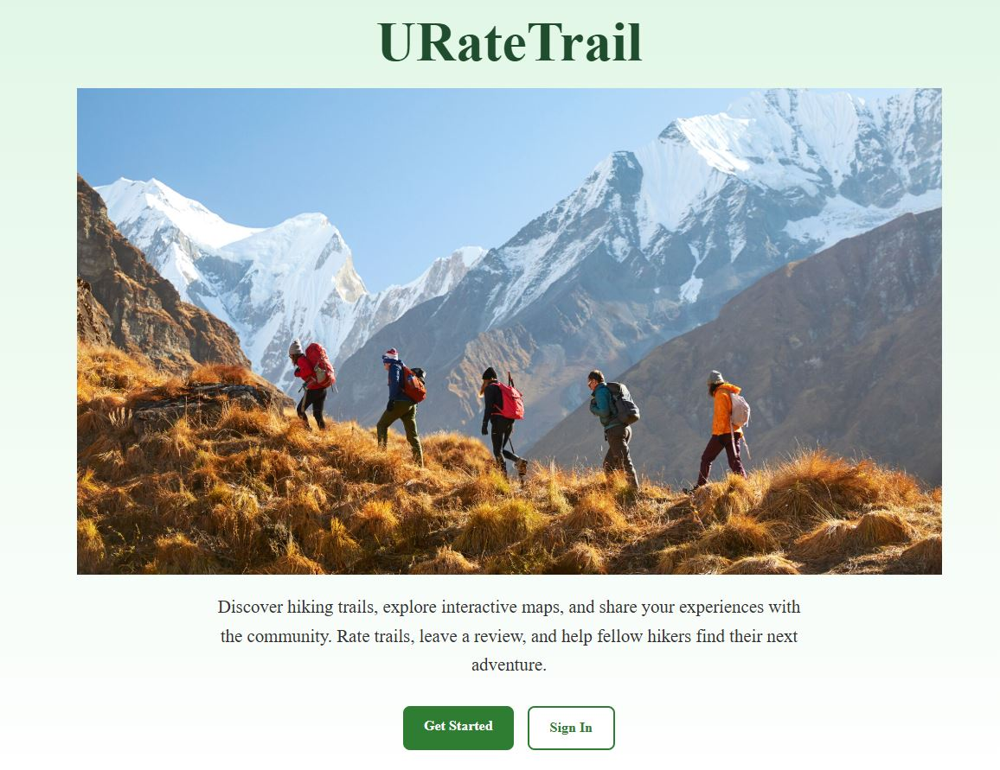

# URateTrail - Frontend



URateTrail is a community-driven hiking web application that allows users to explore hiking trails, view locations on an interactive map, and share experiences through ratings and comments.

This repository contains the **frontend client application** built with **React** and **Vite**. The application communicates with a custom **Express + MongoDB backend API** using RESTful routes and includes user authentication, trail management, and interactive map functionality powered by the Google Maps API.

---

## Features

- User authentication (Sign Up / Sign In)
- JWT-based session management
- Interactive trail map using Google Maps API
- View hiking trail locations with map markers
- Browse trail information and descriptions
- Leave ratings and comments on trails
- Responsive UI design
- REST API integration with backend services

---

## Live Demo

 (https://uratetrail.netlify.app)
---

## Team

- William Frontend (https://github.com/LonerRasta143/uratetrail-app-front-end)
- Carlos Backend: (https://github.com/lecharles/uratetrail-app-back-end/tree/main)

---

## Tech Stack

### Frontend
- React
- Vite
- React Router DOM
- JavaScript
- HTML5
- CSS3

### Maps & APIs
- Google Maps API
- @vis.gl/react-google-maps

### Backend
- Express.js
- MongoDB
- Mongoose
- JWT Authentication

---

## Installation

Clone the repository:

```bash
git clone https://github.com/LonerRasta143/uratetrail-app-front-end.git
cd uratetrail-app-front-end